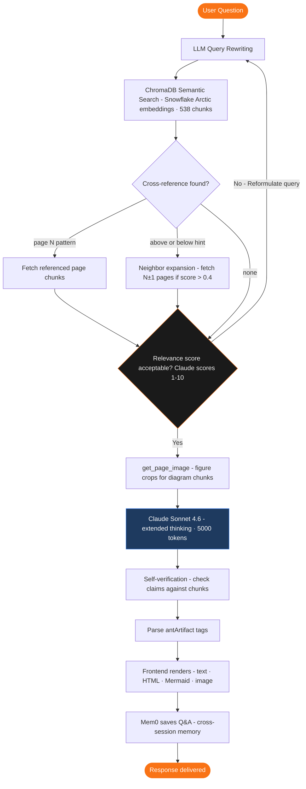
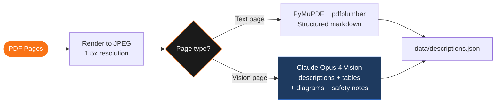
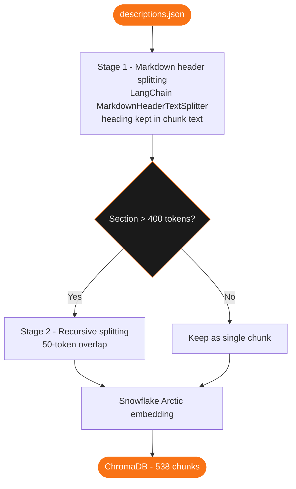
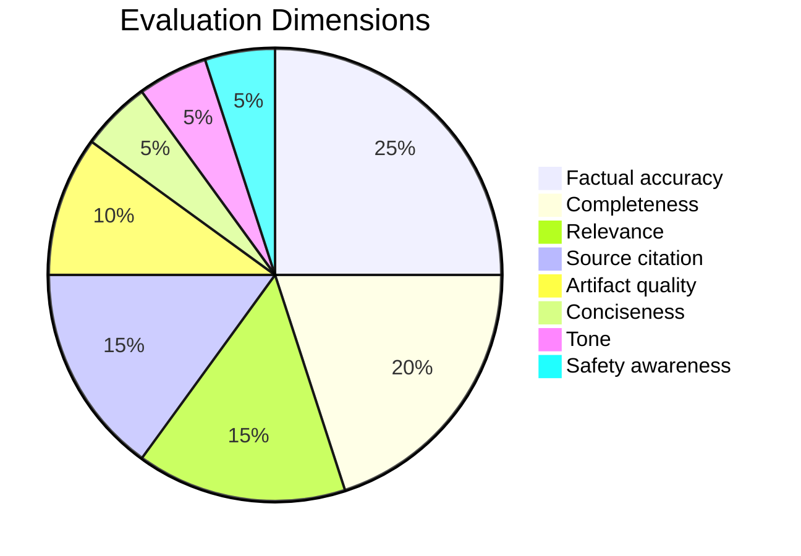

# OmniPro 220 - AI Assistant

A multimodal reasoning agent for the Vulcan OmniPro 220 welder, built on the Anthropic Claude Agent SDK. Not a chatbot that summarizes the manual - an agent that retrieves, reasons, and generates interactive responses tailored to what you actually asked.

**[Live demo](https://omnipro-220-1092779878425.us-central1.run.app/)** · **[Watch the walkthrough](https://www.loom.com/share/486af02564394132b4495c281df2cbaf)**
> Note: the walkthrough was recorded on an earlier build. The live app reflects all latest updates.
---

## Quick Start

```bash
git clone -b prox-challenge-ap https://github.com/AneriPatel28/prox-challenge-AP.git
cd prox-challenge-AP
```

```bash
python -m venv .venv && source .venv/bin/activate # Windows: .venv\Scripts\activate
```

```bash
cp .env.example .env && cp frontend/.env.local.example frontend/.env.local
#Add Anthropic API key
```

```bash
pip install -r requirements.txt
```

```bash
npm install && cd frontend && npm install && cd ..
```

```bash
npm run dev
```

Open the frontend at port 3000. Backend runs on port 8090.

> ChromaDB, pre-processed knowledge base, and PDFs are all committed - no preprocessing step needed.

---

## How the Agent Works

A user asks a question. Here is what happens end-to-end:



The agent uses a **ReAct loop** - it reasons, calls a tool, observes the result, and reasons again. On a complex question like "I'm getting porosity in my flux-cored welds," the agent makes 4-6 tool calls before answering: pulling troubleshooting chunks, weld diagnosis images, and gas flow specs in sequence. A single prompt cannot do this.

---

## Knowledge Extraction

**File:** `backend/preprocess.py`

The OmniPro 220 manual has 51 pages across 3 files containing mixed content: spec tables, polarity wiring diagrams, weld diagnosis photos, step-by-step illustrated procedures, and a selection chart that is entirely an image. Text-only extraction loses the most important information.

### Two-path pipeline

Every page is rendered to JPEG at 1.5x resolution using PyMuPDF, then routed based on content type:



**Why Opus 4 for vision?** I tested Haiku and Sonnet. The quality difference on technical pages was significant. Haiku would return: *"a diagram showing cable connections."* Opus 4 returned: *"a wiring diagram showing the positive socket connects to the wire feed gun and the negative socket connects to the ground clamp - this configuration is DCEP, used for MIG solid wire welding."* That specificity is what makes retrieval work on polarity questions. Preprocessing runs once offline - the cost was justified by the output quality.

### Figure extraction with Docling

Beyond full-page images, I use **Docling** (IBM's ML-based PDF layout detector) to detect and crop individual figures. PyMuPDF's `get_images()` only finds raster images embedded in the PDF binary. Wiring schematics in this manual are vector drawings - invisible to PyMuPDF, visible to Docling's layout model. Each figure is filtered by minimum dimensions and aspect ratio to exclude decorative elements, then saved as a separate JPEG with 30px padding so surrounding labels are not clipped.

Displaying full-page images in the frontend would show too much unrelated content alongside the relevant diagram. By using Docling's cropped figure output, the frontend renders only the specific figure the user needs - no surrounding text or unrelated page content.

**Output:** `data/descriptions.json` - human-readable JSON you can open and verify before embedding. `data/images/` - full-page JPEGs and figure crops.

---

## Chunking & Embedding

**File:** `backend/embed_and_store.py`

### Chunking strategy

A 500-word page describing both the duty cycle table and the wire installation procedure will retrieve for queries about either topic but return too much noise. Each chunk needs to represent a single concept.



### Embedding model - Snowflake Arctic

**Model:** `Snowflake/snowflake-arctic-embed-m` (440MB, runs locally on CPU)

Arctic is built for asymmetric retrieval - short queries matched against long documents. User questions here are 5-10 words; manual chunks are 400-token technical passages. Symmetric models embed both sides the same way, which hurts this mismatch. Arctic uses separate representation spaces, implemented via a query prefix (`"Represent this sentence for searching relevant passages: "`) applied only at retrieval time in `search_manual()`, never when storing chunks. It also ranks among the top models on BEIR retrieval benchmarks at its size class, which matters here since retrieval quality directly caps answer quality.

Running locally was the other factor. The challenge constraint is one API key. Arctic loads once at startup under 3 seconds and embeds at under 10ms per query - an API-based model adds ~200ms of network latency per call, which compounds across 4-6 tool calls per response.

---

## Vector Store - ChromaDB

**Why ChromaDB:**

The challenge constraint is one API key (`ANTHROPIC_API_KEY`). Pinecone, Weaviate, and Qdrant Cloud all require their own credentials. ChromaDB runs entirely in-process with persistent disk storage - no separate service, no additional credentials.

**What we considered and rejected:**
- **Pinecone** - best retrieval quality, but requires its own API key
- **Weaviate Cloud** - same issue
- **FAISS** - no built-in persistence, requires custom serialization
- **pgvector** - needs a running Postgres instance, too much setup overhead

`data/chroma/` is committed to the repo. Anyone who clones gets 538 pre-embedded chunks immediately - no setup step required.

**Two separate ChromaDB instances:**
- `data/chroma/` → `manual_pages` collection → knowledge base (538 chunks)
- `data/chroma_memory/` → `agent_memory` collection → Mem0 cross-session memory

Separate `PersistentClient` instances to avoid collection conflicts at startup.

---

## Agentic Loop

**File:** `backend/agent.py`

The agent implements **ReAct + CRAG + self-verification** using the Anthropic Claude Agent SDK. Generation uses **Claude Sonnet 4.6** with extended thinking (`budget_tokens: 5000`).

### LLM query rewriting

Before every search, Claude translates the user's natural language into technical manual terminology. This is baked into the tool schema description, so it happens automatically on every call including follow-up searches within the same ReAct loop.

### CRAG (Corrective RAG)

After retrieval, Claude evaluates the relevance of retrieved chunks before using them. If scores are low, it reformulates the query and retrieves again. This prevents hallucination from low-quality retrieval - a common failure mode where the model confidently answers based on tangentially related chunks. The CRAG logic lives in the system prompt, not hardcoded: Claude is instructed to score each chunk and re-search if needed.

### Cross-reference resolution

Manual chunks frequently reference other pages ("see page 11"). When detected, I fetch those pages using a combined query - the original user question plus the sentence containing the reference. This gives the search two signals: what the user asked and what the manual says is on that page, which outperforms searching with the user query alone.

### Neighbor expansion

After cross-reference resolution, `expand_neighbors()` fetches the most query-relevant chunk from pages N−1 and N+1 for each retrieved chunk (same source). This handles implicit continuity - procedures that spill across page boundaries or content that says "as described above." Neighbors are only added if their relevance score exceeds 0.4, so unrelated adjacent pages don't pollute the context.

### Self-verification

Before generating the final response, Claude checks its own claims against the retrieved chunks. If it cannot find a source for a specific value or statement, it either drops the claim or flags uncertainty. This catches cases where the model would otherwise complete an answer with plausible-sounding but unsourced information.

### Tools

```python
search_manual(query, n_results=5)
# Semantic search over ChromaDB. Returns chunks with relevance scores,
# source, page number, and figure URLs.

get_page_image(source, page)
# Returns full-page JPEG URL + figure crop URLs for a specific manual page.

ask_clarification(question)
# Asks the user for missing context before answering.
# Used when: material type unknown, thickness unknown, voltage unknown.
```

### Memory - Mem0

When a user mentions their setup ("I'm welding 3mm mild steel on 240V"), that context should persist across sessions. I used Mem0 because it handles the full memory lifecycle - extraction, storage, and retrieval - without building a custom pipeline. It uses Claude Haiku for cheap fact extraction and ChromaDB as the backend, which I already had running for the knowledge base.

Memory is scoped per `session_id`. After every response, the Q&A summary is saved to Mem0. On subsequent turns, the top-5 relevant memories are retrieved and injected into the system prompt before Claude generates a response. Memory search is only triggered after 4 prior user turns to avoid overhead on fresh sessions. The user never has to re-explain their setup.

---

## Multimodal Artifacts

The most complex part. Claude generates responses with embedded artifact tags:

```
<antArtifact identifier="porosity-flow" type="text/html" title="Porosity Troubleshooter">
<!DOCTYPE html>...</antArtifact>
```

The frontend streams Claude's response, parses these tags out, and renders them as interactive components. The tag format was reverse-engineered from Claude.ai's artifact system.

### Artifact trigger rules

Triggers are **criteria-based, not hardcoded**. Hardcoding "porosity question → flowchart" misses spatter questions, wire feed questions, burn-through questions. Criteria cover all of them:

| Artifact type | Trigger criterion |
|--------------|-------------------|
| HTML calculator | "Is the answer a continuous value the user would explore at different settings?" |
| HTML flowchart | "Does the user need to rule out causes one by one to find their specific problem?" |
| HTML step guide | "Would my text response be more than 3 paragraphs of numbered steps?" |
| Mermaid diagram | Physical connections, cable routing, polarity wiring |
| Image | Visual that text cannot convey - specific component location, reference chart |
| None | Simple one-line facts, yes/no, basic definitions |

### HTML artifact design

Artifacts are fully self-contained - no external CDN. They use CSS variables (`--bg`, `--accent`, `--border`) defined in the site theme, so they automatically match dark/light mode. The system prompt includes a complete working HTML template showing Claude exactly what "interactive" means: click handlers, JS state management, conditional rendering. Without a concrete example, Claude defaults to static HTML.

### Frontend rendering

- **HTML** → sandboxed `<iframe srcdoc>` with auto-resize via `postMessage`
- **Mermaid** → client-side `mermaid.render()` with CSS variable-aware theme config (reads `getComputedStyle` at render time so theme changes update the diagram)
- **Images** → figure crops preferred over full-page scans; no title repeated inside the frame if already shown in the header

---

## Evaluation

**Files:** `backend/eval_scorer.py`, `data/eval_test_cases.json`

65 hand-crafted test cases. LLM-as-judge scoring using Claude Haiku.

### Results

| Category | Score | Cases |
|----------|-------|-------|
| Specs | 93.8% | 8 |
| Polarity | 94.5% | 5 |
| Settings | 93.3% | 8 |
| Troubleshooting | 91.9% | 8 |
| Visual | 89.2% | 4 |
| Cross-reference | 88.2% | 4 |
| Ambiguous | 94.6% | 4 |
| Tone | 87.6% | 3 |
| Safety | 94.6% | 4 |
| Robustness | 98.9% | 6 |
| Rejection | 97.3% | 7 |
| Prompt injection | 99.4% | 4 |
| **Overall** | **93.9%** | **65** |

**Pass rate: 65/65 (100%)**

### How the judge works

Each test case defines ground truth:

```json
{
  "must_mention": ["shielding gas", "spool gun"],
  "must_not_claim": ["standard MIG gun works for aluminum"],
  "key_facts": ["use spool gun", "100% argon shielding gas"],
  "sources_expected": ["owner-manual page 22"]
}
```

The judge scores 8 dimensions per response:



**Key design decision:** `factual_accuracy` and `completeness` are deliberately separated. A response that omits information but states nothing wrong should score high on accuracy. Early versions conflated them - missing `must_mention` items would penalize the accuracy score, making it impossible to distinguish "said something wrong" from "didn't say enough." Fixing this separation caught a real scoring bug where the agent's correct statement ("standard MIG gun won't work for aluminum") was being penalized as a `must_not_claim` violation because the judge misread a negation.

Run evals on CLI or view on AI scoreboard (UI):

```bash
python scripts/run_eval.py
```

---

## Frontend

Built with Next.js 16, Tailwind CSS, `next-themes` for dark/light mode.

| Page | Purpose |
|------|---------|
| `/` | Landing - process overview, quick-start cards, auto-flip process tiles |
| `/chat` | Main AI assistant - chat thread + artifact panel side by side |
| `/manual` | PDF viewer - all 3 source documents with page navigation |
| `/eval` | AI Scorecard - live evaluation results with per-dimension breakdowns |

**Key decisions:**
- **Dark mode default** - welders work in garages
- **Artifact panel beside chat** - interactive content stays visible while reading the text response
- **FloatingBot** - rule-based site navigation bot, deliberately separate from the AI assistant
- **Voice input** - Web Speech API (STT), no additional API key

---

## Deployment

Hosted on GCP Cloud Run. Two services: FastAPI backend + Next.js frontend.

**Why GCP Cloud Run:** Serverless, Docker-native, scales to zero. Considered Vercel for the frontend but keeping both services on one platform simplified CORS configuration.

**Key deployment decisions:**

- **CPU-only PyTorch** - default `pip install torch` pulls a 2GB CUDA build. Specifying `--index-url https://download.pytorch.org/whl/cpu` installs the CPU build (~600MB). Build time: 16min → 4min.

- **Model baked into Docker image** - Cloud Run's shared IPs hit HuggingFace rate limits on container startup. The model is downloaded during `docker build` (once), stored on disk in the image, never downloaded at runtime.

- **`.gcloudignore`** - without it, `gcloud builds submit` uploaded 1.6GB (46,000+ files). With it: 26MB, 81 files.

- **Two-step deploy** - `NEXT_PUBLIC_*` env vars are baked into the Next.js bundle at build time. The frontend must be rebuilt after the backend URL is known.

```bash
# Backend
gcloud builds submit --config cloudbuild-backend.yaml \
  --substitutions=_ANTHROPIC_KEY=$ANTHROPIC_API_KEY .

# Frontend
gcloud builds submit --config cloudbuild-frontend.yaml \
  --substitutions=_BACKEND_URL=https://omnipro-backend-cgvah75fkq-uc.a.run.app .
```

---

## Project Structure

```
prox-challenge-AP/
├── backend/
│   ├── agent.py            # Agent loop, tools, system prompt, artifact parser
│   ├── main.py             # FastAPI server, endpoints
│   ├── eval_scorer.py      # LLM-as-judge evaluation
│   ├── preprocess.py       # PDF → descriptions + images (output committed)
│   ├── embed_and_store.py  # Descriptions → ChromaDB (output committed)
│   └── templates/          # HTML artifact templates
├── frontend/src/
│   ├── app/                # Pages: /, /chat, /manual, /eval
│   └── components/         # ArtifactFrame, ChatMessage, MermaidDiagram, FloatingBot
├── data/
│   ├── chroma/             # Vector store - 538 chunks (committed)
│   ├── images/             # Page JPEGs + figure crops (committed)
│   ├── descriptions.json   # Opus Vision output (inspect before chunking)
│   ├── chunks.json         # Chunked output (inspect before embedding)
│   └── eval_results.json   # Latest evaluation run
├── files/                  # Source PDFs
├── scripts/run_eval.py     # Run full evaluation suite
├── cloudbuild-backend.yaml
├── cloudbuild-frontend.yaml
└── package.json            # Root: `npm run dev` starts both backend + frontend
```

---

## What I'd Do Next

- **Better visual grounding** - weld diagnosis photos are in the manual but figure cropping occasionally misses them; a custom detector trained on welding manual layouts would fix this
- **Streaming artifacts** - the full artifact appears at once; streaming HTML generation progressively would feel more responsive
- **Feedback loop to eval** - the `/api/user-feedback` endpoint collects thumbs up/down; connecting it to automatically flag weak responses and add them to the eval suite would create a self-improving system
- **Multi-turn retrieval** - retrieved chunks reset between turns; carrying forward the most relevant chunks from prior turns would improve follow-up question quality without extra retrieval cost
